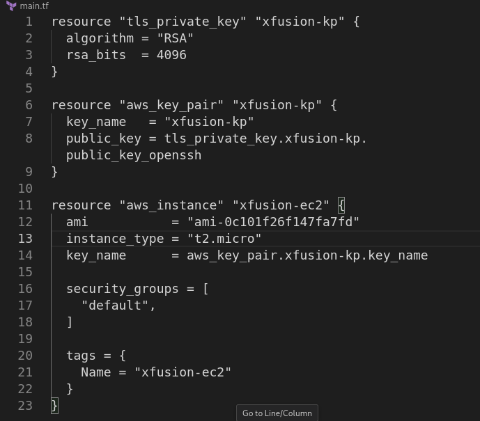
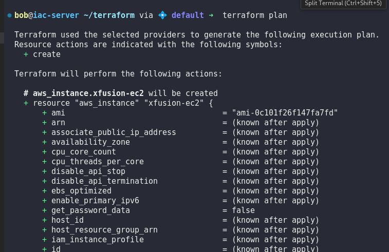
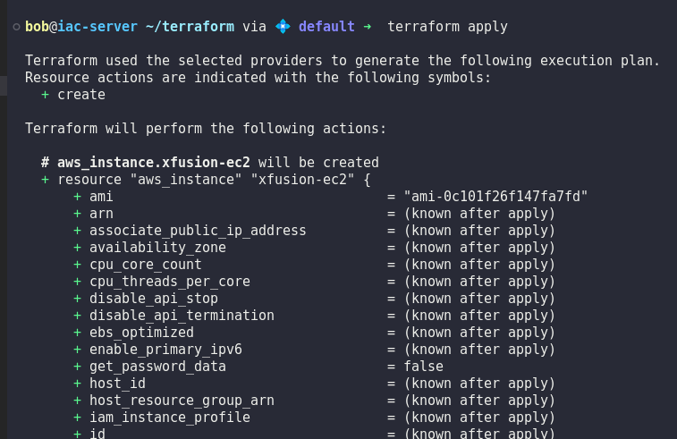

# Day 96: Create EC2 Instance Using Terraform

**subject**

***

The Nautilus DevOps team is strategizing the migration of a portion of their infrastructure to the AWS cloud. Recognizing the scale of this undertaking, they have opted to approach the migration in incremental steps rather than as a single massive transition. To achieve this, they have segmented large tasks into smaller, more manageable units.

For this task, create an EC2 instance using `Terraform` with the following requirements:

1. The EC2 instance must use the value `xfusion-ec2` as its Name tag, which defines the instance name in AWS.
2. Use the `Amazon Linuxami-0c101f26f147fa7fd` to launch this instance.
3. The Instance type must be `t2.micro`.
4. Create a new RSA key named `xfusion-kp`.
5. Attach the default (available by default) security group.The Terraform working directory is `/home/bob/terraform`. Create the `main.tf` file (do not create a different `.tf` file) to provision the instance. `Note:` Right-click under the `EXPLORER` section in `VS Code` and select `Open in Integrated Terminal` to launch the terminal.

***

https://registry.terraform.io/providers/hashicorp/aws/latest/docs/resources/instance

https://medium.com/@a-dem/creating-an-ec2-instance-on-aws-with-terraform-78cc6450ce75

https://iac.goffinet.org/infrastructure-as-code/terraform-ansible-provisioner/

https://notes.kodekloud.com/docs/Terraform-Basics-Training-Course/Terraform-Provisioners/AWS-EC2-with-Terraform/page

https://thukhakyawe.hashnode.dev/1create-key-pair-using-terraform-level-1

* Check the current work

- Create the terraform configuration file

* Exec and check

