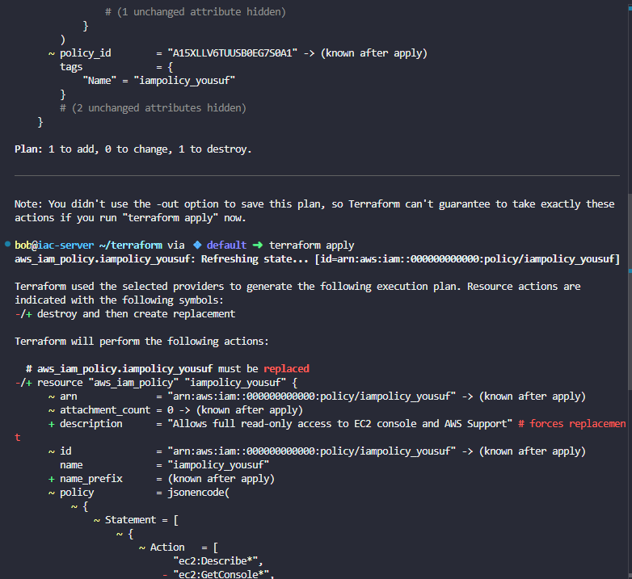
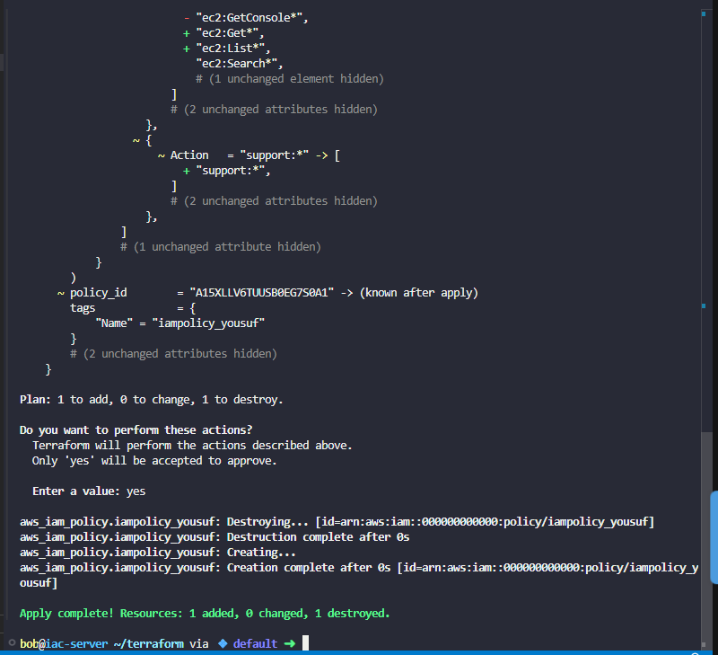

# Day 97: Create IAM Policy Using Terraform

**subject**

***

When establishing infrastructure on the AWS cloud, Identity and Access Management (IAM) is among the first and most critical services to configure. IAM facilitates the creation and management of user accounts, groups, roles, policies, and other access controls. The Nautilus DevOps team is currently in the process of configuring these resources and has outlined the following requirements.

Create an IAM policy named`iampolicy_yousuf`in`us-east-1`region using Terraform. It must allow read-only access to the EC2 console, i.e., this policy must allow users to view all instances, AMIs, and snapshots in the Amazon EC2 console.

The Terraform working directory is`/home/bob/terraform`. Create the`main.tf`file (do not create a different`.tf`file) to accomplish this task.

`Note:`Right-click under the`EXPLORER`section in`VS Code`and select`Open in Integrated Terminal`to launch the terminal.

***

https://registry.terraform.io/modules/terraform-aws-modules/iam/aws/latest

https://blog.stephane-robert.info/docs/infra-as-code/provisionnement/terraform/aws/iam-role-policy-instance-profile/

https://medium.com/@trodan/how-to-create-a-read-only-iam-policy-for-ec2-in-aws-step-by-step-guide-5aabec3b3ead

* Check the current work

- Create the terraform configuration file

* Check

- Run

