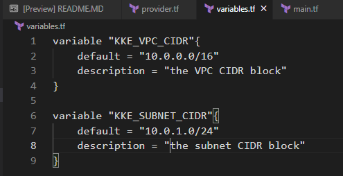
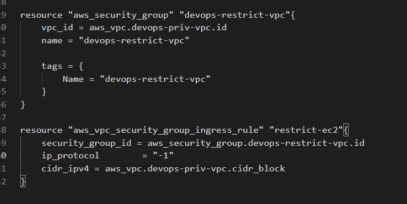
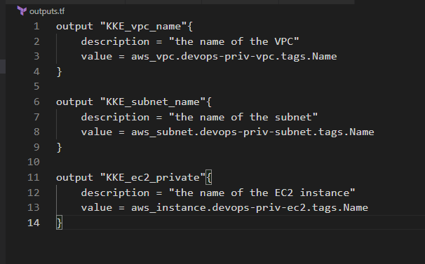
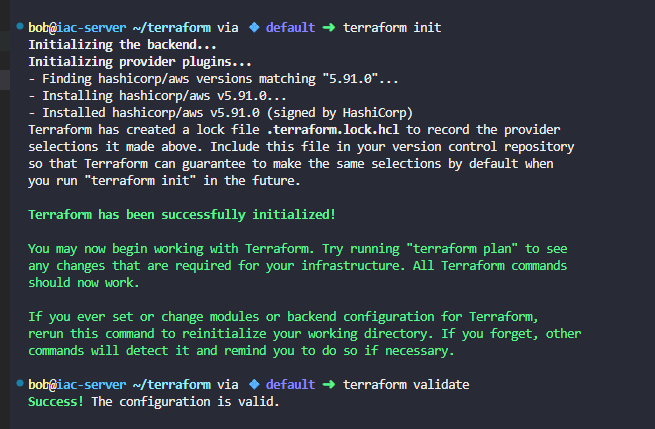
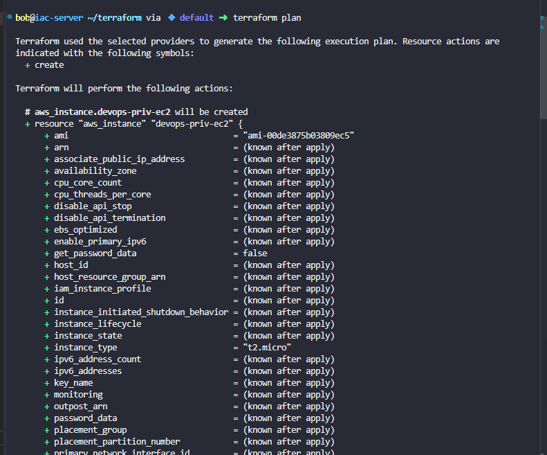
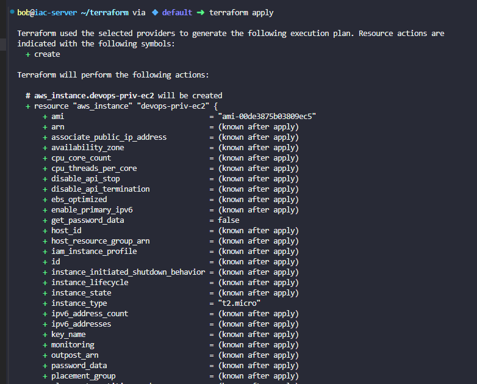
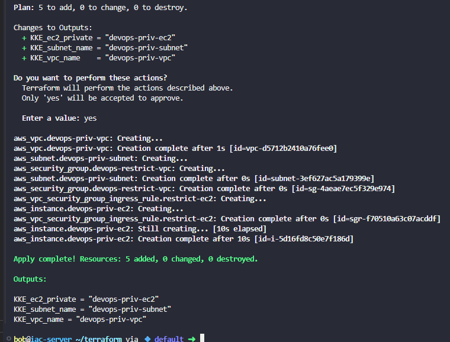
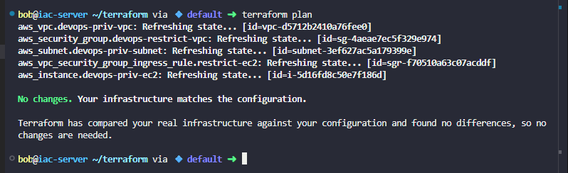

# Day 98: Launch EC2 in Private VPC Subnet Using Terraform

**subject**

***

The Nautilus DevOps team is expanding their AWS infrastructure and requires the setup of a private Virtual Private Cloud (VPC) along with a subnet. This VPC and subnet configuration will ensure that resources deployed within them remain isolated from external networks and can only communicate within the VPC. Additionally, the team needs to provision an EC2 instance under the newly created private VPC. This instance should be accessible only from within the VPC, allowing for secure communication and resource management within the AWS environment.

1. Create a VPC named`devops-priv-vpc`with the CIDR block`10.0.0.0/16`.
2. Create a subnet named`devops-priv-subnet`inside the VPC with the CIDR block`10.0.1.0/24`and`auto-assign`IP option must not be`enabled`.
3. Create an EC2 instance named`devops-priv-ec2`inside the subnet and instance type must be`t2.micro`.
4. Ensure the security group of the EC2 instance allows access only from within the VPC's CIDR block.
5. Create the`main.tf`file (do not create a separate`.tf`file) to provision the VPC, subnet and EC2 instance.
6. Use`variables.tf`file with the following variable names:
   * `KKE_VPC_CIDR`for the VPC CIDR block.
   * `KKE_SUBNET_CIDR`for the subnet CIDR block.
7. Use the`outputs.tf`file with the following variable names:
   * `KKE_vpc_name`for the name of the VPC.
   * `KKE_subnet_name`for the name of the subnet.
   * `KKE_ec2_private`for the name of the EC2 instance.

**Notes:**

1. The Terraform working directory is`/home/bob/terraform`.
2. Right-click under the`EXPLORER`section in`VS Code`and select`Open in Integrated Terminal`to launch the terminal.
3. Before submitting the task, ensure that`terraform plan`returns`No changes. Your infrastructure matches the configuration.`

***

https://registry.terraform.io/providers/-/aws/latest/docs/resources/vpc

https://registry.terraform.io/providers/hashicorp/aws/latest/docs/resources/subnet

https://registry.terraform.io/providers/hashicorp/aws/latest/docs/resources/instance.html

https://registry.terraform.io/providers/-/aws/6.8.0/docs/resources/security\_group

https://registry.terraform.io/providers/-/aws/latest/docs/resources/vpc

* Check current work

- Create the varible.tf

* Create the main.tf

* Create the outputs.tf

* Check

* Run

