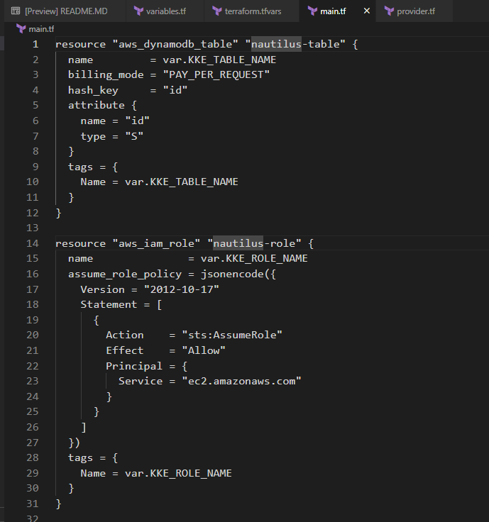
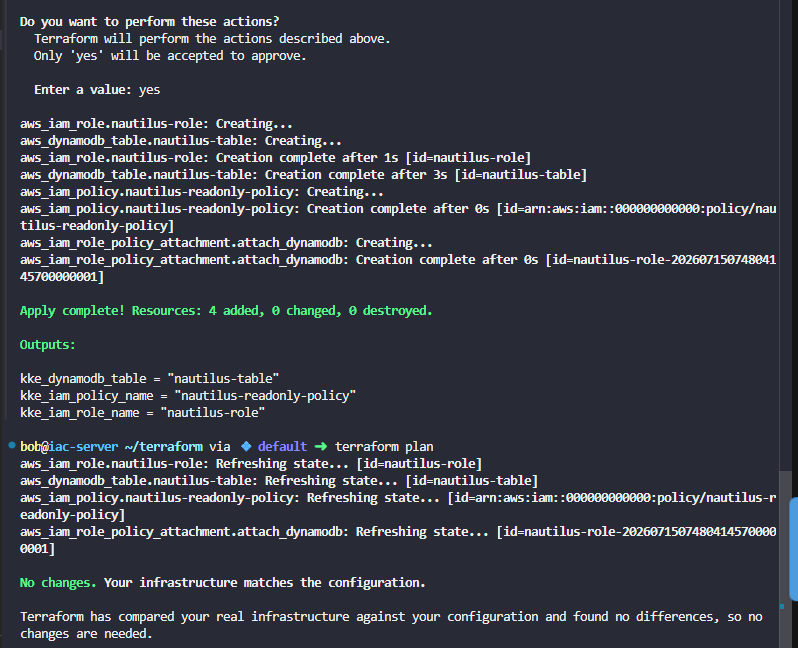

# Day 99: Attach IAM Policy for DynamoDB Access Using Terraform

**subject**

***

The DevOps team has been tasked with creating a secure DynamoDB table and enforcing fine-grained access control using IAM. This setup will allow secure and restricted access to the table from trusted AWS services only.

As a member of the Nautilus DevOps Team, your task is to perform the following using Terraform:

1. **Create a DynamoDB Table:**&#x43;reate a table named`datacenter-table`with minimal configuration.
2. **Create an IAM Role:**&#x43;reate an IAM role named`datacenter-role`that will be allowed to access the table.
3. **Create an IAM Policy:**&#x43;reate a policy named`datacenter-readonly-policy`that should grant read-only access (GetItem, Scan, Query) to the specific DynamoDB table and attach it to the role.
4. Create the`main.tf`file (do not create a separate`.tf`file) to provision the table, role, and policy.
5. Create the`variables.tf`file with the following variables:
   * `KKE_TABLE_NAME`: name of the DynamoDB table
   * `KKE_ROLE_NAME`: name of the IAM role
   * `KKE_POLICY_NAME`: name of the IAM policy
6. Create the`outputs.tf`file with the following outputs:
   * `kke_dynamodb_table`: name of the DynamoDB table
   * `kke_iam_role_name`: name of the IAM role
   * `kke_iam_policy_name`: name of the IAM policy
7. Define the actual values for these variables in the`terraform.tfvars`file.
8. Ensure that the`IAM policy`allows only read access and restricts it to the specific`DynamoDB table`created.

**Notes:**

1. The Terraform working directory is`/home/bob/terraform`.
2. Right-click under the`EXPLORER`section in`VS Code`and select`Open in Integrated Terminal`to launch the terminal.
3. Before submitting the task, ensure that`terraform plan`returns`No changes. Your infrastructure matches the configuration.`

***

https://blog.stephane-robert.info/docs/infra-as-code/provisionnement/terraform/ecrire-code/fichiers-tfvars/

https://developer.hashicorp.com/terraform/tutorials/configuration-language/variables

https://docs.aws.amazon.com/IAM/latest/UserGuide/reference\_policies\_examples\_dynamodb\_specific-table.html

https://registry.terraform.io/providers/hashicorp/aws/latest/docs/resources/iam\_policy.html

https://developer.hashicorp.com/terraform/tutorials/aws/aws-iam-policy

* Check current work

- Create the variable.tf

* Create the terraform.tfvars (we use it like secret like when we want that we wouldn't push our secret in like .gitignore)

- Create the main.tf

* Create output.tf

- Check

* run

